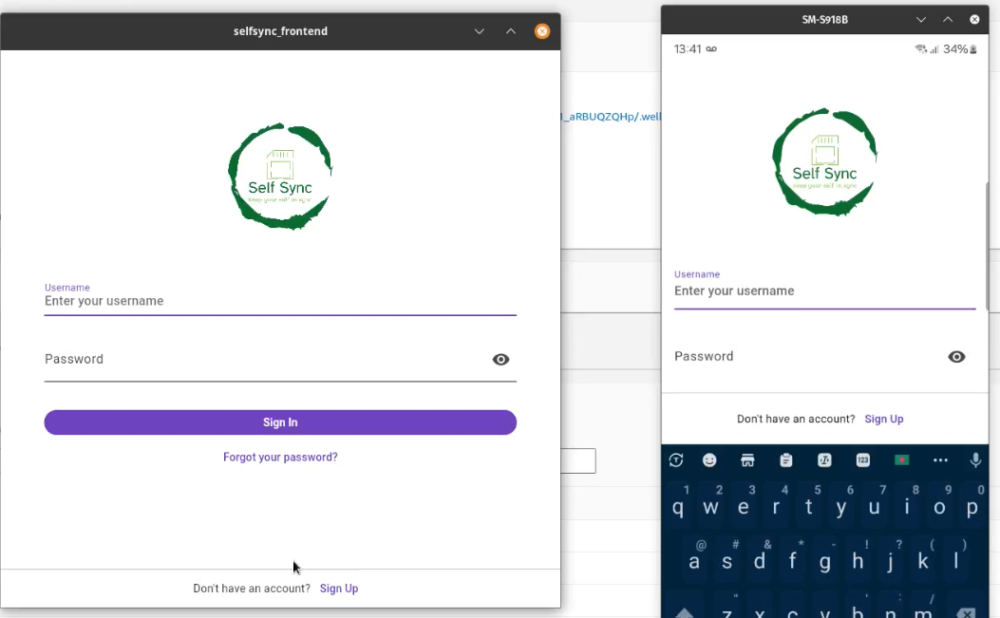
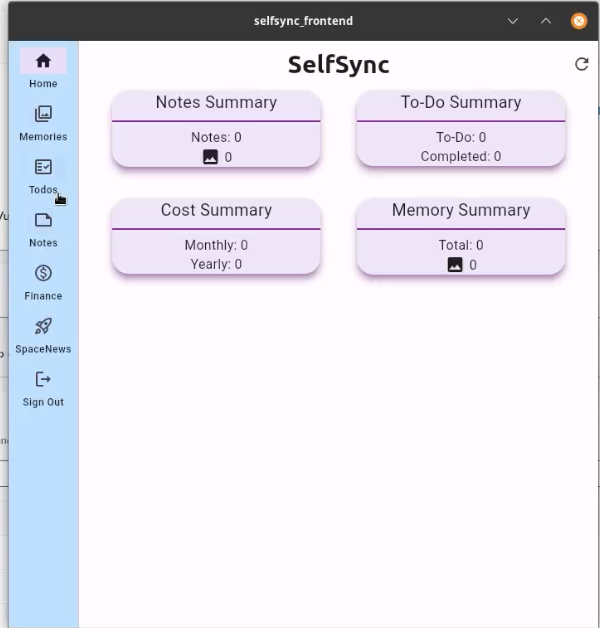
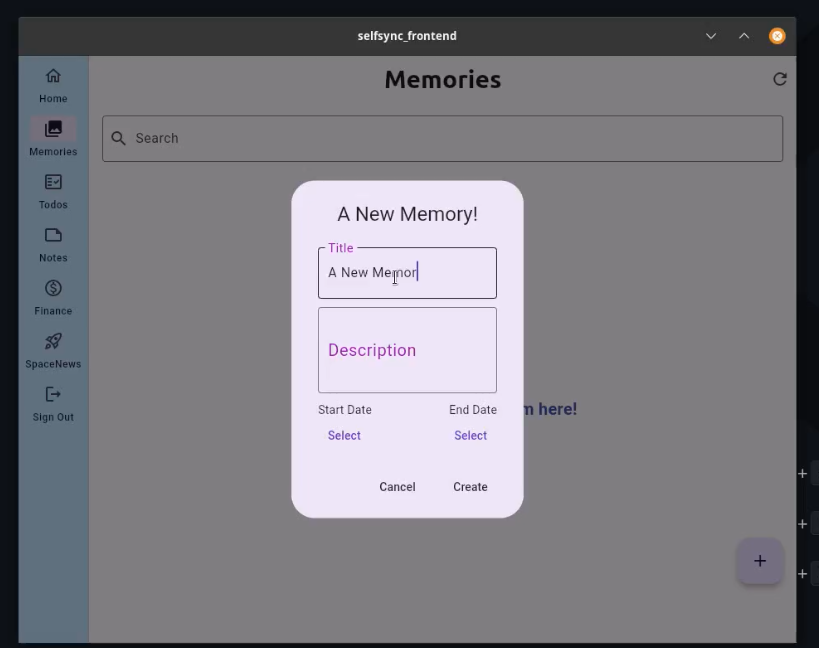
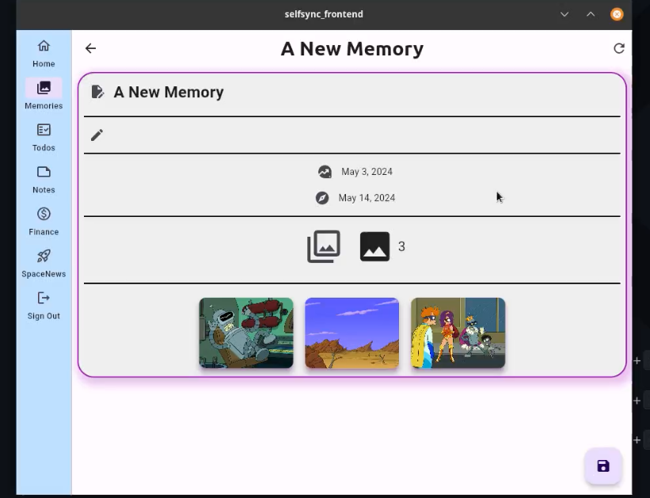
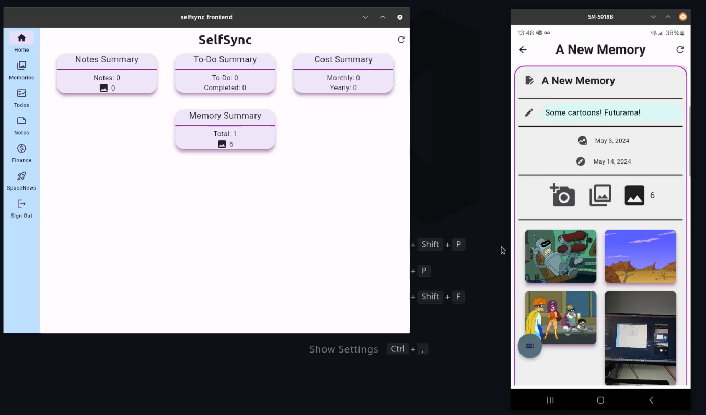
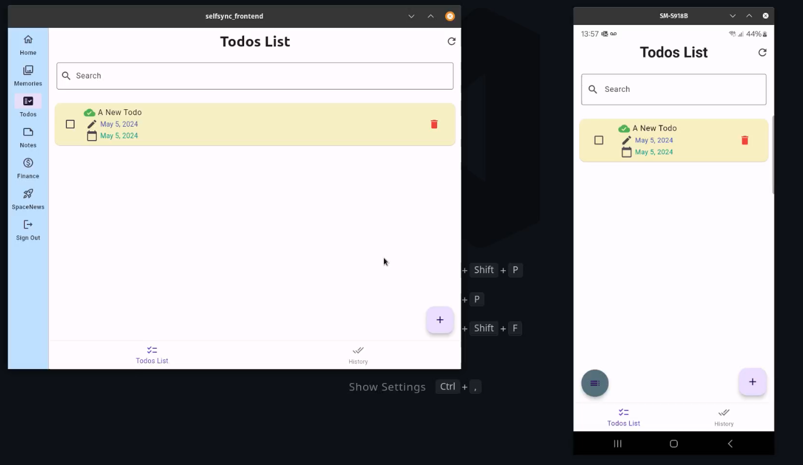

# Building SelfSync

Please checkout the `SelfSync-Basic-Idea.pdf` file for the basic idea of the project.

SelfSync has two parts: a frontend built using Flutter framework and Amplify, and a backend built using AWS Serverless Architecture Model (SAM) templates.

### Amplify Documentation:
https://docs.amplify.aws/gen1/flutter/start/getting-started/introduction/


## Steps

To build it the following steps need to be followed:

**Step 1: Initialize Amplify application from the root of the `selfsync_frontend` directory** 
```sh
# from the root of the repository
cd ./selfsync_frontend
amplify init
```
This should create `amplifyconfiguration.dart` file in the root of the directory. This file contains all the required configurations.

**Step 2: Add Authentication and an S3 bucket to the Amplify Project**
```sh
# from the root of the repository
cd ./selfsync_frontend
# amplify add auth # https://docs.amplify.aws/gen1/flutter/build-a-backend/auth/set-up-auth/ # already added in the project, no need to add again
# amplify add storage # https://docs.amplify.aws/gen1/flutter/build-a-backend/storage/set-up-storage/ # already added in the project, no need to add again
amplify push
```

After this step open up the `amplifyconfiguration.dart` file and find `PoolId` from `CognitoUserPool` bloc (POOLID). Now create the Arn of the UserPoolID in the following format: `arn:aws:cognito-idp:REGION:ACCOUNTID:userpool/POOLID` and note it down. This will be used in the next step.
Here, `REGION` is the region where the Cognito User Pool is created, `ACCOUNTID` is the AWS account ID, and `POOLID` is the User Pool ID.

**Step 3: Add the CognitoUserPoolArn to the SAM template in `selfsync_backend/template.yaml`**

Open up the file mentioned above and find the keyword `UserPoolArn` in the file, and provide the merged PoolId from the Step 2 in suitable position.


**Step 4: Build backend resources**
```sh
# from the root of the repository
cd ./selfsync_backend
sam build
sam deploy --guided # --guided for the first time deployment of backend resources
```
After the process is completed note the API Gateway URL 

**Step 5: Provide the backend api information to frontend**

Use the API Gateway URL from the previous step and add the following bloc in the `amplifyconfiguration.dart` file in the frontend directory.
```dart
    "api": {
        "plugins": {
            "awsAPIPlugin": {
                "SelfSyncRestApi": {
                    "endpointType": "REST",
                    "endpoint": "URL_FROM_STEP_4",
                    "region": "REGION_FROM_STEP_4",
                    "authorizationType": "AMAZON_COGNITO_USER_POOLS"
                }
            }
        }
    }
```

**Step 6: Run the application**
```sh
# from the root of the repository
cd ./selfsync_frontend
flutter run
```

This should start the application on the device/emulator.


## Demo Screenshots











